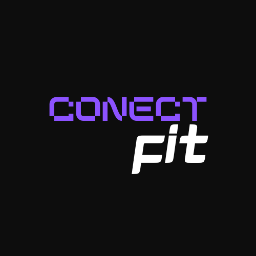

    <h1>ConnectFit</h1>
    <code></code>
    
Gabriel Carvalho

1. Qual o problema?

> Os aplicativos de gerenciamento de treinos não permitem uma conexão muito grande entre profissionais 
e alunos, de forma que não conseguem agregar "tudo em um aplicativo". Desde baixa usabilidade, difícil acesso
a treinos especializados em casos específicos até problemas relacionados a treinamento indevido.

2. Por que ele é relevante?

> Segundo o Instituto Brasileiro de Geografia e Estatística (IBGE) o número de brasileiros que praticam atividades 
físicas em 2019, foi 7,4% maior comparado ao ano de 2013, número que representa alta preocupação com a saúde e forma física, e que está subindo cada vez mais. Por isso, é necessário garantir que as pessoas possuam acesso a uma ferramenta acessível, que proporcione auxílio nos treinos, de forma responsável. 

3. Quem são as pessoas impactadas pelo problema?

> Pessoas de 18 a 60 anos. A Pesquisa Nacional de Saúde, realizada pelo IBGE em 2019, relatou que a faixa etária que mais pratica atividades físicas no Brasil, está entre 18-24 anos, seguido por adultos de 25-39 anos. Porém pessoas com cerca ou acima de 60 anos representam 14% das praticantes de atividades (menor número).

4. Quais os riscos em desenvolver esse projeto?

> É um projeto longo e trabalhoso, levará tempo e necessidade de aprendizado em vários conceitos. É um projeto de escalabilidade lenta quando comparado a serviços ainda mais básicos como alimentação. Possui grandes concorerntes como a Nike.

5. Quais os concorrentes?

> Nike training Club, Fitbit, MyFitnessPal, Freeletics, Mfitpersonal

6. Quais funcionalidades iniciais serão incorporadas ao projeto?

> O objetivo será fazer um mvp para validar o projeto, dessa forma, as funcionalidades iniciais serão as mais básicas possíveis, como cadastro de profissionais e alunos e cadastro de treinos e anamneses.

link documento de requisitos > 